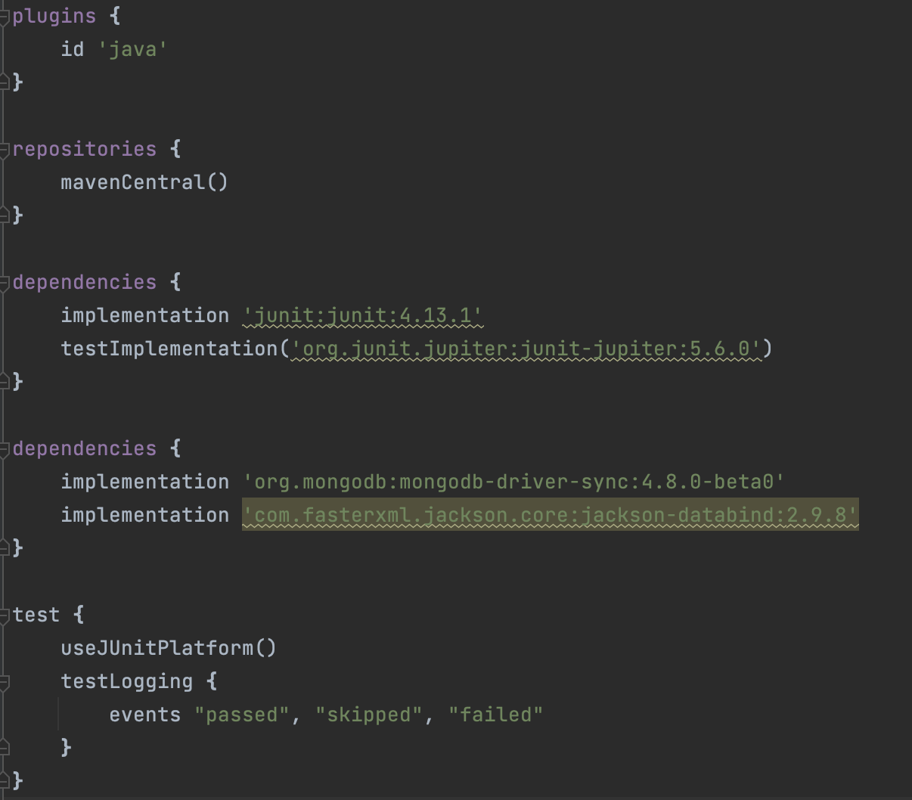

# Budget Bites (Group 90) ReadMe Document

Welcome to Budget Bites. The project is aimed at giving the students cheap food options around the UofT campus.

This project consist of several features such as PriceFiltering, RestaurantFiltering, suggestionToUser and Reviews (which can be found in their subsequent UseCases Folder).
Above those features we used Java Swing to create a seamless user flow UI. We have also implemented MongoDB for the backend which saves all the entities. 

**Kindly follow the instruction below**

## Checklist for building the project ##
- [ ] Ensure SDK version is 11.0.17 (See the image below and match it with Project Structure)

- [ ] Go to the `build.gradle` file and check the dependency. If the dependency is correct then build the gradle again. **Important for MongoDB to work.** 

**Now that you have build the project, it is time to start the UI. Follow the steps in the next section to ensure that you correctly open the Java Swing UI**

## Opening the application in main

- [ ] Go to `src/main/java/main.java`
- [ ] Run the main file, and new JFrame will be prompted. Enjoy the UI.

**Finally you can also run tests in `src/test/java` to ensure the features not covered in the UI are working as well. We have provided unit tests for use cases as well.**

## SOLID Principles and Clean Architecture

**For implementing clean architecture we have created packaging for each class. That includes their interactor, gateways, request model, Input and Output boundary. We have provided an example of Clean Architecture implementation. Kindly follow the instruction to check out that file.**
- [ ] Go to `src/main/java/usecases/Filtering/RestaurantFiltering`, which is an example implementation.

[//]: # ()
[//]: # (## Checklist For Your Project)

[//]: # ()
[//]: # (- [ ] Verify the correct settings for your project repository)

[//]: # ()
[//]: # (- [ ] Set up Github Projects)

[//]: # ()
[//]: # (- [ ] Create the implementation plan using issues and Github Projects)

[//]: # ()
[//]: # (- [ ] Create deveopment branches for your features)

[//]: # ()
[//]: # (- [ ] Use pull requests to merge finished features into main branch)

[//]: # ()
[//]: # (- [ ] Conduct code reviews)

[//]: # ()
[//]: # ()
[//]: # (**If your team has trouble with any of these steps, please ask on Piazza. For example, with how GitHub Classroom works, your team *may* not have permissions to do some of the first few steps, in which case we'll post alternative instructions as needed.**)

[//]: # ()
[//]: # ()
[//]: # (## Workflow Documents)

[//]: # ()
[//]: # ()
[//]: # (* Github Workflow: Please refer to the workflow that was introduced in the first lab. You should follow this when working on your code. The following document provides additional details too.)

[//]: # ()
[//]: # ()
[//]: # (* [Project Planning and Development Guide]&#40;project_plan_dev.md&#41;: This document helps you to understand how to create and maintain a project plan for your class project. **This document helps you to complete the Implementation Plan Milestone.**)

[//]: # ()
[//]: # ()
[//]: # (## Gradle Project)

[//]: # ()
[//]: # (Import this project into your Intellij editor. It should automatically recognise this as a gradle repository.)

[//]: # ()
[//]: # (The starter code was built using SDK version 11.0.1. Ensure that you are using this version for this project. &#40;You can, of course, change the SDK version as per your requirement if your team has all agreed to use a different version&#41;)

[//]: # ()
[//]: # ()
[//]: # (You have been provided with two starter files for demonstration: HelloWorld and HelloWorldTest.)

[//]: # ()
[//]: # ()
[//]: # (You will find HelloWorld in `src/main/java/tutorial` directory. Right click on the HelloWorld file and click on `Run HelloWorld.main&#40;&#41;`.)

[//]: # ()
[//]: # (This should run the program and print on your console.)

[//]: # ()
[//]: # ()
[//]: # (You will find HelloWorldTest in `src/test/java/tutorial` directory. Right click on the HelloWorldTest file and click on `Run HelloWorldTest`.)

[//]: # ()
[//]: # (All tests should pass. Your team can remove this sample of how testing works once you start adding your project code to the repo.)

[//]: # ()
[//]: # ()
[//]: # (Moving forward, we expect you to maintain this project structure. You *should* use Gradle as the build environment, but it is fine if your team prefers to use something else -- just remove the gradle files and push your preferred project setup. Assuming you stick with Gradle, your source code should go into `src/main/java` &#40;you can keep creating more subdirectories as per your project requirement&#41;. Every source class can auto-generate a test file for you. For example, open HelloWorld.java file and click on the `HelloWorld` variable as shown in the image below. You should see an option `Generate` and on clicking this your should see an option `Test`. Clicking on this will generate a JUnit test file for `HelloWorld` class. This was used to generate the `HelloWorldTest`.)

[//]: # ()
[//]: # ()
[//]: # (![image]&#40;https://user-images.githubusercontent.com/5333020/196066655-d3c97bf4-fdbd-46b0-b6ae-aeb8dbcf351d.png&#41;)

[//]: # ()
[//]: # ()
[//]: # (You can create another simple class and try generating a test for this class.)
